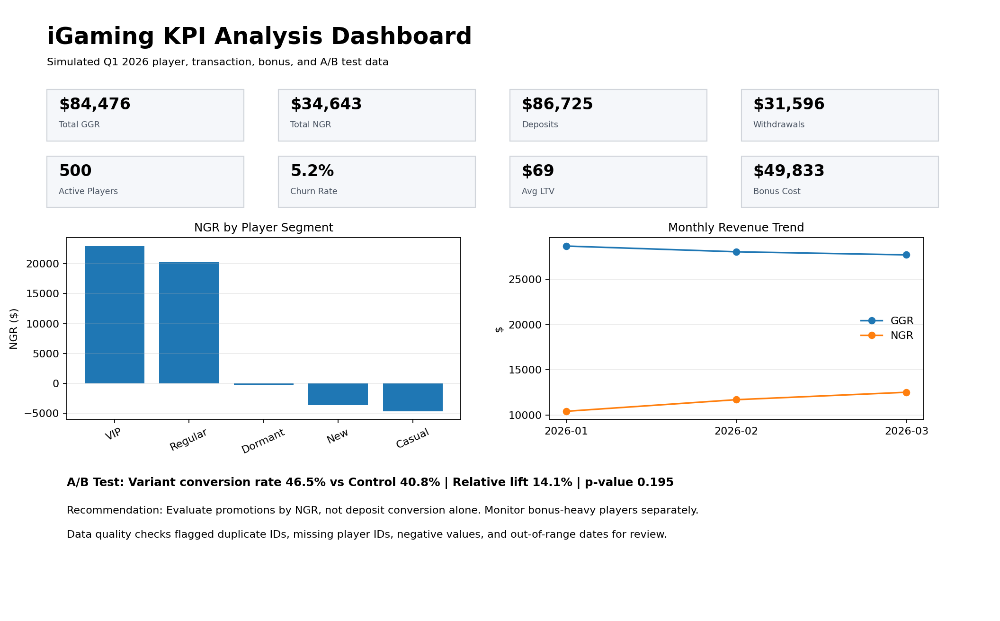

# iGaming KPI Analysis Project

## Project Overview

This is a portfolio-ready Junior Data Analyst project built around a simulated iGaming dataset. It mirrors the type of work described in roles that require SQL, Excel reporting, KPI monitoring, A/B test support, and data quality validation.

The project analyzes fictional player, transaction, bonus, and A/B test data for Q1 2026.

## Business Questions

1. Which player segments generate the highest gross and net gaming revenue?
2. Are bonuses improving player value or creating bonus abuse risk?
3. Which players show signs of churn?
4. Did the promotional A/B test improve deposit conversion?
5. Are there data quality issues or suspicious anomalies?

## Tools and Skills Demonstrated

- SQL analysis using joins, aggregations, CASE logic, CTEs, date filtering, and validation checks
- Excel dashboarding and KPI reporting
- Pivot-style summaries and ad-hoc reporting logic
- iGaming KPI definitions and calculations
- A/B test interpretation using conversion rate, lift, and p-value
- Data quality checks for duplicates, nulls, negative values, and out-of-range dates
- Business-friendly written communication

## KPIs Analyzed

| KPI | Definition Used |
|---|---|
| GGR | Stakes - Winnings |
| NGR | GGR - Bonus Costs |
| Deposit Volume | Total player deposits |
| Withdrawal Volume | Total player withdrawals |
| Active Players | Players with Q1 transaction activity |
| Churn Rate | Players with no activity in the last 30 days as of 2026-04-01 |
| Player LTV | Historical NGR per player during the observation window |
| Bonus Cost | Total bonus value awarded |
| Bonus Abuse Flag | High bonus-to-deposit ratio + negative NGR + meaningful bonus amount |
| Conversion Rate | A/B test players with deposit conversion / total players |

## Key Findings

- VIP and Regular segments produced the strongest net revenue, but higher bonus costs created a need to evaluate promotions by NGR rather than GGR alone.
- Several players were flagged for potential bonus abuse based on high bonus usage, low deposit behavior, and negative NGR.
- The promotional A/B test showed a higher deposit conversion rate for the Variant group than the Control group.
- The test should still be evaluated by net revenue impact, not conversion alone.
- Data quality checks identified intentionally inserted issues, including duplicate transaction IDs, missing player IDs, negative monetary values, and out-of-range dates.

## Files Included

| File | Purpose |
|---|---|
| `iGaming_KPI_Workbook.xlsx` | Main Excel workbook with dashboard, KPI summaries, data quality checks, and source data |
| `SQL_Queries.sql` | Redshift-style SQL queries for KPI calculations and validation |
| `iGaming_KPI_Case_Study.pdf` | One-page business case study for recruiter/hiring-manager review |
| `data_dictionary.md` | Dataset fields and KPI definitions |
| `dashboard_screenshot.png` | Visual preview of dashboard |
| `datasets/players.csv` | Simulated player dimension table |
| `datasets/transactions.csv` | Simulated transaction fact table |
| `datasets/bonuses.csv` | Simulated bonus campaign data |
| `datasets/ab_test_results.csv` | Simulated A/B test result data |

## How I Would Explain This Project in an Interview

I built a simulated iGaming KPI analysis project to mirror the type of work expected from a Junior Data Analyst. The project uses player, transaction, bonus, and A/B test data to calculate key business metrics like GGR, NGR, deposits, withdrawals, churn, LTV, and bonus abuse indicators.

The main focus was not just producing numbers, but validating whether those numbers made sense. I included data quality checks for duplicate IDs, missing player IDs, negative values, and out-of-range transaction dates. I also summarized the A/B test by conversion rate, lift, p-value, and business recommendation.

## Resume Bullet Version

- Built a simulated iGaming analytics project using SQL and Excel to calculate GGR, NGR, deposit volume, withdrawal volume, player LTV, churn rate, bonus cost, and bonus abuse indicators.
- Wrote Redshift-style SQL queries using JOINs, GROUP BY, CASE WHEN, CTEs, date filtering, and aggregations to analyze player and transaction behavior.
- Created an Excel reporting workbook with KPI summaries, dashboard visuals, data validation checks, and A/B test analysis.
- Flagged potential data quality issues including duplicate transaction IDs, missing player IDs, negative values, and unusual date patterns.
- Summarized findings in a one-page business case study for non-technical stakeholders.

## Disclaimer

All data in this project is simulated and fictional. No real gambling, customer, or financial data is included.
